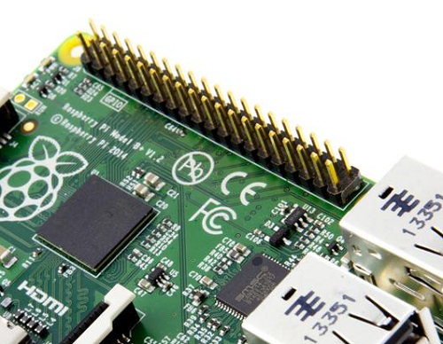

## Introduction

### How can we detect a fart?

Flatulence or *farts* are essentially gasses that are produced in the stomach and bowels by bacterial fermentation during the process of digestion. The scientific study of farts and fart gases is known as *flatology*, a future career for some of you perhaps? It is perfectly normal for human beings to pass wind every day although the amount varies greatly between individuals, it can range from a tiny amount up to and in excess of two litres.

You'll be surprised to learn that 99% of fart gasses do not smell at all. These include oxygen, nitrogen, carbon dioxide, hydrogen and methane. The remaining 1% is what gives farts their smell and these are mostly volatile sulphuric compounds. The same stuff that makes rotten eggs smell.

To detect a fart with the Raspberry Pi we need to use a sensor that is responsive to one or more of these gasses. Essentially we need to give the Raspberry Pi a *nose*. The sensor recommended for this project is the Figaro TGS2600 and costs around £10.

Here is a close-up of it:

Firstly it is important for us to understand how this sensor works. The sensor is designed to measure air quality or rather how *contaminated* the air is. The datasheet for those of you who want it can be found [here](http://www.figarosensor.com/products/2600pdf.pdf).

To summarise it has six holes to allow air to go inside. The air is then energised by a small heater which allows its electrical resistance to be measured. This is done by passing a low level of electricity across a small gap of energised air. Generally speaking the more contaminated the air is the less resistance it has and the better it will conduct electricity (like a variable resistor). The output of the sensor is therefore an analogue voltage that goes up and down according to how contaminated the air is. The more contaminants the higher the voltage output.

### Analogue vs Digital

We also need to understand that the air quality sensor gives us an *analogue* signal. So let's look at what analogue means as opposed to digital as a concept. Digital signals are essentially binary 1 or 0, on or off. Analogue signals have the full range *between* on or off. Think of a car steering wheel. The wheel is analogue because you have a full range of steering available to the driver. You can steer very gently around a long sweeping corner, you can turn the wheel to full lock or anywhere in between. If you wanted to steer a car digitally you would basically have full lock left and full lock right only, like steering using the indicator stick.

Those of you who play computer games may have experienced this before. Look at your control pad and consider the differences between the use of the analogue thumb joystick and the digital D-pad in the games that you play. Analogue and digital both have their place and often one works better for a particular task than the other. For a game like a flight simulator you would want analogue control to aim the plane, whereas for something simple like a jump, run and shoot platform game digital control is better.

I expect you can think of further examples of analogue and digital beyond just these.

### But the Raspberry Pi is digital?

So the challenge we face is being able to read an *analogue* signal on a *digital* computer. The Raspberry Pi GPIO pins can be used as inputs or outputs. Output mode is for when you want to supply voltage to something like an LED or a buzzer. If we use input mode, a GPIO pin has a value that we can read in our code. If the pin has voltage going into it, the reading will be `1` (*HIGH*); if the pin was connected directly to ground (no voltage), the reading will be `0` (*LOW*). So they are digital allowing only `1` or `0`.

How can we solve this? One way would be to use an ADC chip ([Analogue to Digital Converter](http://en.wikipedia.org/wiki/Analog-to-digital_converter)) or something like an [Arduino](http://arduino.cc/en/Main/Products). By connecting the output of the air quality sensor to the input of an ADC we can convert the analogue voltage from the sensor to a digital number in our code.

However this does complicate matters slightly. You would only need to use an ADC if a really accurate reading from the sensor was needed, for example if you wanted to know how many [parts per million](http://en.wikipedia.org/wiki/Parts-per_notation) of methane was present. In practise we just want to make an alarm go off when a fart has been detected so everyone can run! So if you think about it... this is a digital detection. There *is* a fart. There *is no* fart. On or off, binary 1 or 0. We can get away without having to worry about the analogue fidelity coming from the air quality sensor.

We already know that the sensor is like a variable resistor, the worse the air quality the lower the resistance and the more voltage is let through. So logically when the sensor comes into contact with a fart the output voltage should spike. Therefore we just need to detect these voltage spikes and that *can* be done digitally. We can make it so that when a spike occurs a GPIO pin goes from `LOW` to `HIGH`, we can then detect this change in our code and play an alarm sound file!

### The high and low threshold

You now might be wondering how the Raspberry Pi knows if a GPIO pin is `HIGH` or `LOW`?

The answer to this question is actually part of our solution. You may already know that the GPIO pins work at 3.3 volts. So if you set a pin to be `HIGH` in output mode that pin will give/supply 3.3 volts. If you set it to output `LOW` though it will be connected to ground but could form the return path for completing a circuit.

In input mode things work slightly differently. Naturally you would assume that the reading of the pin would be `HIGH` if it was connected to 3.3 volts and `LOW` if connected to ground. There is actually a voltage *threshold* that lies somewhere around 1.1 to 1.4 volts. The actual threshold varies slightly between different hardware revisions of the Raspberry Pi (but we can cope with this). Below the threshold is `LOW` and above it is `HIGH`. So for example 1.0 volt would read `LOW`, despite there actually being some voltage there where as 1.6 volts would read `HIGH` despite this being a lot less than 3.3.

This is quite a hacky way to do it but if we use some resistors to bring the output voltage of the air quality sensor down to *just below* this threshold then the spike caused by a fart will trip it over from `LOW` to `HIGH` and we have our digital fart detection.

